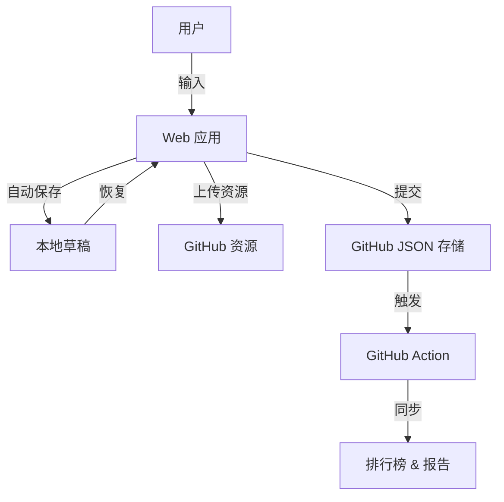

# 系统架构与设计 (Architecture)

## 🏗 系统架构



## 💾 草稿系统

草稿系统使用自定义 React Hook `useLocalDraft` 来管理与 `localStorage` 的状态同步。

### Key: `study-checkin-draft`

数据结构:
```json
{
  "title": "Learning Rust",
  "category": "Backend",
  "tags": ["rust", "memory-safety"],
  "content_md": "...",
  "assets": ["..."],
  "timestamp": "2024-03-16T10:00:00Z"
}
```

### 行为逻辑
1.  **自动保存**: 最后一次按键后 1 秒触发。
2.  **恢复**: 页面加载时，检查是否存在草稿并恢复 UI。
3.  **重置**: 仅在成功提交到 GitHub 后清除草稿。

## 🔌 离线能力

- **写作**: 富文本编辑完全支持离线工作。
- **资源**: 离线时暂不支持上传，系统会提示用户联网后重试（以保证数据纯净性）。
- **提交**: 需要在线连接。

## 🎨 主题系统

系统使用 Tailwind CSS 和 CSS 变量进行主题定制。
主题定义在 `src/context/ThemeContext.tsx` 中，并通过 `data-theme` 属性应用。

- **Solana**: `#9945FF` (紫色) & `#14F195` (绿色)
- **Cyberpunk**: `#00F0FF` (青色) & `#FF003C` (粉色) & `#FTEE0E` (黄色)
